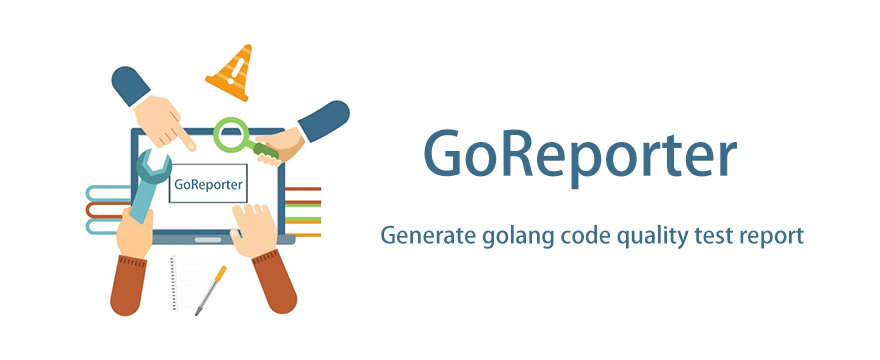
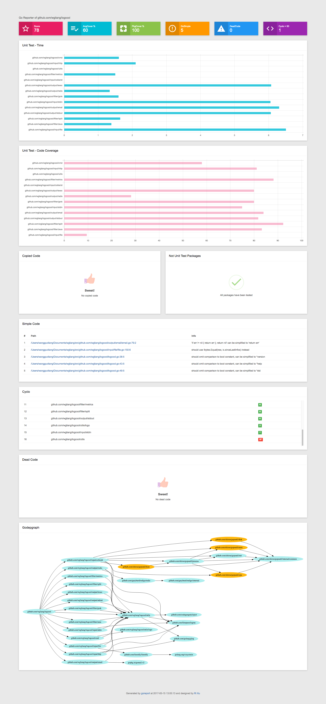

# goreporter [](https://github.com/wgliang/goreporter/releases/tag/version2.5.0)

[](https://github.com/wgliang/goreporter/releases/latest)
[](https://travis-ci.org/wgliang/goreporter)
[](https://godoc.org/github.com/wgliang/goreporter)
[](http://www.apache.org/licenses/LICENSE-2.0.html)

A Golang tool that does static analysis, unit testing, code review and generate code quality report. This is a tool that concurrently runs a whole bunch of those linters and normalizes their output to a report:

# Branch features

<!-- MarkdownTOC -->

- [Supported linters](#supported-linters)
- [Supported template](#supported-template)
- [Todo List](#todo-list)
- [Installing](#installing)
	- [Requirements](#requirements)
- [Run it](#run-it)
- [Credits](#credits)
- [Quickstart](#quickstart)
- [Example](#example)
- [Report-example](#report-example)
- [Credits](#credits)

<!-- /MarkdownTOC -->

## Supported linters

- [unittest](https://github.com/wgliang/goreporter/tree/master/linters/unittest) - Golang unit test status.
- [deadcode](https://github.com/tsenart/deadcode) - Finds unused code.
- [gocyclo](https://github.com/alecthomas/gocyclo) - Computes the cyclomatic complexity of functions.
- [varcheck](https://github.com/opennota/check) - Find unused global variables and constants.
- [structcheck](https://github.com/opennota/check) - Find unused struct fields.
- [aligncheck](https://github.com/opennota/check) - Warn about un-optimally aligned structures.
- [errcheck](https://github.com/kisielk/errcheck) - Check that error return values are used.
- [copycode(dupl)](https://github.com/mibk/dupl) - Reports potentially duplicated code.
- [gosimple](https://github.com/dominikh/go-tools/tree/master/cmd/gosimple) - Report simplifications in code.
- [staticcheck](https://github.com/dominikh/go-tools/tree/master/cmd/staticcheck) - Statically detect bugs, both obvious and subtle ones.
- [godepgraph](https://github.com/kisielk/godepgraph) - Godepgraph is a program for generating a dependency graph of Go packages.
- [misspell](https://github.com/client9/misspell) - Correct commonly misspelled English words... quickly.
- [countcode](https://github.com/bytbox/sloc) - Count lines and files of project.


## Supported template

- html template file which can be loaded via `-t <file>`.

## Todo List

- There are still many shortcomings in the presentation of the report, showing that the model is not perfect, and hope that someone can help optimize it.

## Installing

### Requirements

- [Go](https://golang.org/dl/) 1.6+
- [Graphviz](http://www.graphviz.org/Download..php)

## Quickstart

Install goreporter (see above).

```
$ go get -u github.com/wgliang/goreporter
```

## Run it:

```
$ goreporter -p [projectRelativePath] -r [reportPath] -e [exceptPackagesName] -f [json/html/text]  {-t templatePathIfHtml}
```

- -p Must be a valid Golang project path.
- -r Save the path to the report.
- -e Exceptional packages (multiple separated by commas, for example: "linters/aligncheck,linters/cyclo" ).
- -f report format json, html OR text.
- -t Template path,if not specified, the default template will be used.

By default, the default template is used to generate reports in html format.

## Example

```
$ goreporter -p ../goreporter -r ../goreporter -t ./templates/template.html
```
you can see result detail:[online-example-report](http://fiisio.me/pages/goreporter-report.html)

example:github.com/wgliang/logcool



## Credits

Logo is designed by [xuri](https://github.com/Luxurioust)
